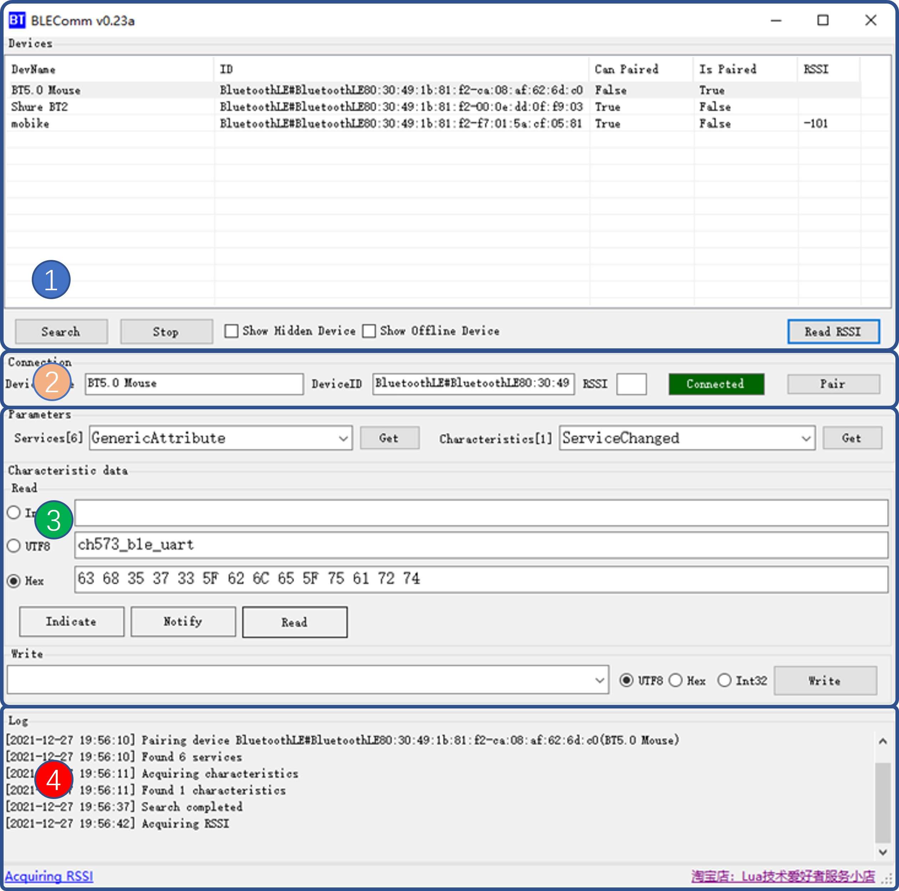

# BLEComm BLE Tools User Manual

## Introduction

BLEComm based on new API of Windows10 OS. The tool could perform BLE device search, service and characteristics read/write and general BLE debug functions. The tool could support Indicate/Notify function of characteristics in cased supported by HW. The tools could decode/encode upstream/downstream automatically and list all hidden/offline device optionally.

BLEComm was written by C#, based on .Net 4.5.2 framework, support Windows10 64bit system. The coded is licensed by MIT, so that you can free to build your own tools based on the opensource code freely. If you have any question, please free to reach me at QQ chat group:970858559. Since the references of BLE API of Windows 10 is not sufficient and the article is also lacked to be found on the internet, there could be some bugs during your usage. Hope you could help me to correct them and make the project growing, thanks!

## 2 Function

Software UI:

### 1 Devices search area

1. Press "Search" button, then you will get all visible device covered by the RF capability of your BLE transceiver.
Based on the regularization of international BLE organization, each BLE device has a unique ID, meanwhile, the manufacture will also provide a friendly device name normally. But the name string is not unique strictly.

2. A BLE device has status bits of ispaired and canpaired. The device will work more synchronized after pairing operation. It will keep existing even if the device is staying on power saving mode after paired, or the device will go offline from the list. But you could still get them by checking "Show Offline Device" checkbox.

3. Some user would like to hide the BLE device by setting the name of device to null, while you could still get them by checking "Show Hidden Device" button.

4 Some BLE chipset could report the RSSI value of itself while you could press "Read RSSI" button to get it. The value is normally positive. Larger, the signal gets better. E.g. -60dbm>-90dbm

## Device status area

1 While double clicking device item listed on above area, the BLE transceiver will try to communicate with specific device for the first try. "Device Name" and "Device ID" text area are showing the information of the specific device. The status bar is "white" means the connecting is in progress, is "red" means the connecting is failed, is "green" means the connection is completed. If failed, you could have another try by pressing "Pair" button.

2 For unpaired BLE device, it's normal to get connected to your BLE transceiver by multiple tries, since the device is not synchronized. The device will be disconnected after entering power saving mode. You could solve it by pair the device in windows system, so that the device will synchronize with your system automatically.

## 3 Characteristic read/write

1 A specific BLE device includes a series of service, and each service includes a series of characteristics. A characteristic is a parameter with appropriate property. Some parameters support read or write function. Some parameters support both read and write function. Some function support passively pushing service. The parameters could be read after acquiring appropriate properties. If it supports read function, you could get the value of it by press "Read" button. If the parameter supports pushing service， related rectangle indicator will blink. Pushing service have two working method, "Indicate" and "Notify", "Indicate" is a reliable service， there will be a respond from the server to the device after receiving the data from the client. "Notify" is one way service with no respond from the server after receiving the data. Received data will be displayed on the "Read" data area, same as reading operation.

2 Read in (or pushed) data could be an integer, a UTF-8 string or a Hex string. 32bit integer and UTF-8 string are the most common datatype. If the device is using user-defined data or any other data cannot be recognized, the data will be displayed in Hex from. In case read operation is not supported, the data area will become dim indicated the unavailable status.

3 If the device support write function, the "Write" button will become available, or the button will become dim indicated the unavailable status. You could write data with agreed data format with your BLE devices. Supported input type includes "Int32", "UTF-8", "Hex".

## 4 Log record and status bar

All your operations could be seen on the "Log" text area. You could fetch source and user manual from the status bar. The maximus capability of log is 2000 bytes. Exceeded part will be deleted.

## HW/SW Compatibility

1 BLEComm are using the newly added API of Windows10, hence early windows OS is not supported, the minimums system requirement is Windows10 64bit.

2 Bluetooth device composed by two types, classical Bluetooth (e.g., as a BT headset) and BLE Bluetooth. The tool could only support BLE device, if your Bluetooth HW version is lower than BT 4.0, the tool will not work unless you plug a new type BLE adapter (I recommended a BT 5.1 adapter, less than $2)

## Message from the developer

Blecomm is developed with personal usage purpose for BLE device develop. Currently, I'm using the tool to turn Air101/Air103 and Ch573 chipset. Before the tool was developed, I have to use a android phone with an app to go on my work, while I need to code the MCU on windows platform. It makes me inconvenient. That's why the tool comes out. Hope it can also help you.

Blecomm is written in C# language, winform based, fully open sourced. The major reference of this program is BT_Windows10_Sample library from Microsoft. The post of gurus on technique forum also helps me a lot. I would like to express my thanks to them.

By the end, please visit my git page at below address, and star me if you feel it's useful.
https://github.com/miuser00/blecomm

