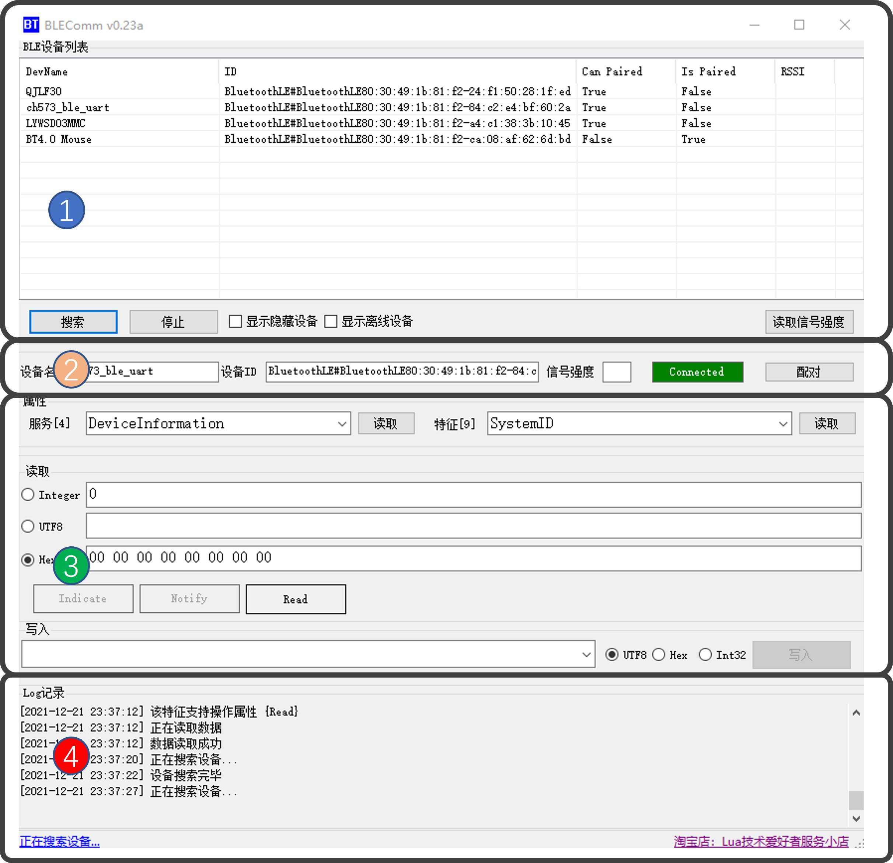
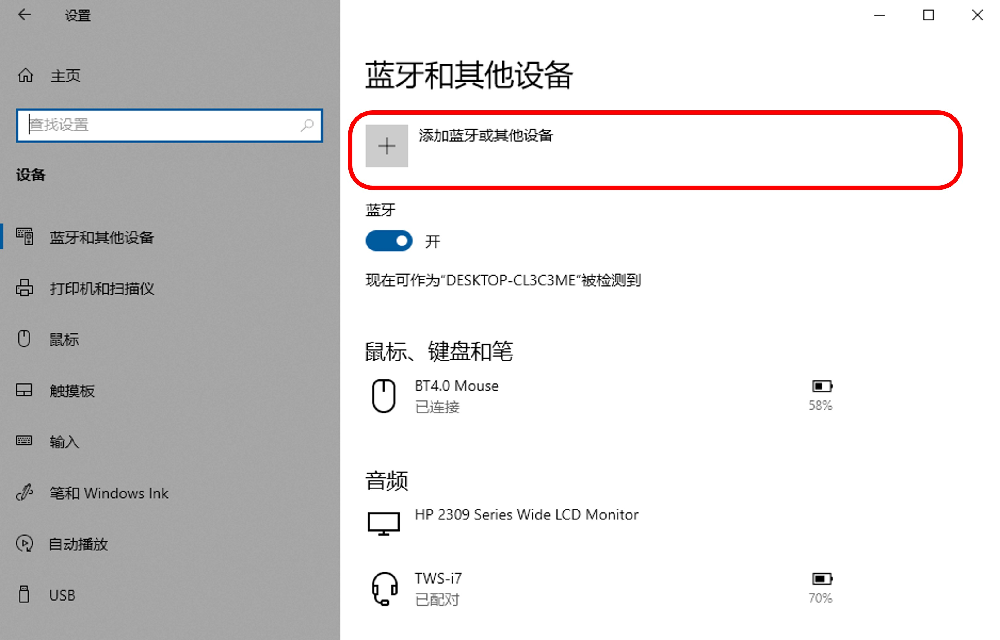

# BLEComm BLE Tools User Manual

## Introduction

BLEComm based on new API of Windows10 OS. The tool could perform BLE device search, service and characteristics read/write and general BLE debug functions. The tool could support Indicate/Notify function of characteristics in cased supported by HW. The tools could decode/encode upstream/downstream automatically and list all hidden/offline device optionally.

BLEComm was written by C#, based on .Net 4.5.2 framework, support Windows10 64bit system. The coded is licensed by MIT, so that you can free to build your own tools based on the opensource code freely. If you have any question, please free to reach me at QQ chat group:970858559. Since the references of BLE API of Windows 10 is not sufficient and the article is also lacked to be found on the internet, there could be some bugs during your usage. Hope you could help me to correct them and make the project growing, thanks!

## 2 Function

Software UI:

### 1 Devices search area

1. Press "Search" button, then you will get all visible device covered by the RF capability of your BLE transceiver.
Based on the regularization of international BLE organization, each BLE device has a unique ID, meanwhile, the manufacture will also provide a friendly device name normally. But the name string is not unique strictly.

2. A BLE device has status bits of ispaired and canpaired. The device will work more synchronized after pairing operation. It will keep existing even if the device is staying on power saving mode after paired, or the device will go offline from the list. But you could still get them by checking "Show Offline Device" checkbox.

3. Some user would like to hide the BLE device by setting the name of device to null, while you could still get them by checking "Show Hidden Device" button.

4 Some BLE chipset could report the RSSI value of itself while you could press "Read RSSI" button to get it. The value is normally positive. Larger, the signal gets better. E.g. -60dbm>-90dbm

## Device status area

1 While double clicking device item listed on above area, the BLE transceiver will try to communicate with specific device for the first try. "Device Name" and "Device ID" text area are showing the information of the specific device. The status bar is "white" means the connecting is in progress, is "red" means the connecting is failed, is "green" means the connection is completed. If failed, you could have another try by pressing "Pair" button.

2 For unpaired BLE device, it's normal to get connected to your BLE transceiver by multiple tries, since the device is not synchronized. The device will be disconnected after entering power saving mode. You could solve it by pair the device in windows system, so that the device will synchronize with your system automatically.

## 3 Characteristic read/write

1 A specific BLE device includes a series of service, and each service includes a series of characteristics. A characteristic is a parameter with appropriate property. Some parameters support read or write function. Some parameters support both read and write function. Some function support passively pushing service. The parameters could be read after acquiring appropriate properties. If it supports read function, you could get the value of it by press "Read" button. If the parameter supports pushing service， related rectangle indicator will blink. Pushing service have two working method, "Indicate" and "Notify", "Indicate" is a reliable service， there will be a respond from the server to the device after receiving the data from the client. "Notify" is one way service with no respond from the server after receiving the data. Received data will be displayed on the "Read" data area, same as reading operation.

2 Read in (or pushed) data could be an integer, a UTF-8 string or a Hex string. 32bit integer and UTF-8 string are the most common datatype. If the device is using user-defined data or any other data cannot be recognized, the data will be displayed in Hex from. In case read operation is not supported, the data area will become dim indicated the unavailable status.

3 If the device support write function, the "Write" button will become available, or the button will become dim indicated the unavailable status. You could write data with agreed data format with your BLE devices. Supported input type includes "Int32", "UTF-8", "Hex".

## 4 Log record and status bar

All your operations could be seen on the "Log" text area. You could fetch source and user manual from the status bar. The maximus capability of log is 2000 bytes. Exceeded part will be deleted.

## HW/SW Compatibility

1 BLEComm are using the newly added API of Windows10, hence early windows OS is not supported, the minimums system requirement is Windows10 64bit.

2 Bluetooth device composed by two types, classical Bluetooth (e.g., as a BT headset) and BLE Bluetooth. The tool could only support BLE device, if your Bluetooth HW version is lower than BT 4.0, the tool will not work unless you plug a new type BLE adapter (I recommended a BT 5.1 adapter, less than $2)

## Message from the developer

Blecomm is developed with personal usage purpose for BLE device develop. Currently, I'm using the tool to turn Air101/Air103 and Ch573 chipset. Before the tool was developed, I have to use a android phone with an app to go on my work, while I need to code the MCU on windows platform. It makes me inconvenient. That's why the tool comes out. Hope it can also help you.

Blecomm is written in C# language, winform based, fully open sourced. The major reference of this program is BT_Windows10_Sample library from Microsoft. The post of gurus on technique forum also helps me a lot. I would like to express my thanks to them.

By the end, please visit my git page at below address, and star me if you feel it's useful.
https://github.com/miuser00/blecomm

---
# BLEComm BLE蓝牙调试工具使用说明

## 基本介绍

BLEComm基于Windows10新加入的的BLE通讯API编写完成，可以完成设备搜索、服务及特征读写等基本蓝牙调试功能。支持设备端Indicate和Notify消息推送，支持RSSI蓝牙发射信号强度读取（需要硬件支持），支持数据自动解码，支持隐藏及离线设备检索等功能。

BLEComm采用C#编写，基于.Net 4.5.2框架，支持Windows10以上64位操作系统，代码部分采用Mit授权，便于您进行移植。 使用中有任何问题欢迎加群与作者直接交流，QQ群：970858559 目前市面上关于Windows10环境下BLE操作的相关介绍比较少，再加上Windows10的 BLE API尚不十分完善，程序目前在兼容性和稳定性方面均劣于Android和IOS的表现，笔者对于各类电脑自带的BLE设备也缺乏足够的测试，因此使用中bug难免，希望您愿意同我一并不断完善和改进这个软件，谢谢！

## 功能简介

软件示意图：

### 1.设备搜索区

1. 点击搜索按钮可以列出当前射频信号覆盖区域的所有BLE设备，根据国际蓝牙组织规定，每个蓝牙设备都拥有全球唯一的ID，同时设备厂商也提供了更友好的设备名供用户识别，但该名称并不唯一。

2.  设备有可配对，不可配对，已经配对和未配对这两个状态位，配对后的设备访问会更加流畅，即使设备处于节能状态仍能在列表中显示，否则当设备进入节能状态，设备在列表中就会消失，这时可以通过**点选 “显示离线设备”** 复选框进行显示。

3.  对于有些不想让用户在系统蓝牙配对搜索到的设备，该设备名可能为空，这时可以通过**点选“显示隐藏设备”**复选框进行显示

4. 部分协议较新的高级蓝牙设备会自主上报接收到的信号强度，这时可以通过**点击“读取信号强度”**按键更新该字段的数值，该数值通常为负数，值越大说明信号越强，如-60dbm >-90dbm

### 2.设备状态区

1. 当双击设备列表框中的条目后，该蓝牙设备即被选中出现在设备状态区并开始尝试首次连接，设备名和设备ID指示了当前选中的设备，状态栏的颜色表示连接的状态，白色为连接中，红色为连接失败，绿色为连接成功。如果本次连接失败，您可以点击配对按钮尝试重新连接。

2. 对于尚未配对的蓝牙，由于收发时隙尚未同步，可能需要多次配对才能连接成功，且连接后设备可能因为进入休眠状态而丢失信号连接。这是可以在windows系统中通过绑定配对该设备，这样连接就会变得更加稳定。

### 3.特征写入和读取

1. 对于BLE设备，每个设备可以有若干个服务，每个服务下又有若干个特征。可以把特征看成是一个带有属性的参数，有的参数可以被读取，有的可以被写入，有的可以同时被读写，还有一些支持推送服务。设备特征能力成功读取后，可以根据特征支持的操作类型进行访问，如果是特征是可读的，则可以点击Read按钮，如果该特征支持推送，则该特征对应的参数的值发生变化则相应的矩形框会发出蓝色的闪烁，推送特征又分为Indicate和Notify，Indicate是可靠的信息推送，收到后系统会发送确认。Notify是仅推送，数据收到后不确认。收到的数据最终同主动读取的数据一样都会被显示在数据读取区。

2. 读取（或推送）到的数据分为整数、UTF-8字符串、和Hex字符串，32位整数和UTF-8是最常见的数据类型，对于用户自定义二进制数据或者未被识别的数据将通过Hex方式显示。对于不支持读取操作的服务特征，数据读取区呈灰色为不可用。

3. 对于支持写入操作的服务特征，写入按钮为可用，如果不支持写入，则写入按钮会呈灰色为不可用。用户需要按照设备约定的数据类型输入数据，数据类型可以是32位整数，UTF-8字符串，或者直接以形如 “FF FF FF FF” 的Hex字符串写入。

### 4.Log记录和状态栏

操作过程的具体步骤可以在Log记录区看到，状态栏底部可以下载到说明书和源码。 Log的最大存储长度为2000字节，超出部分会被自动删除。

## 软硬件兼容性

1 BLEComm使用的API为Windows10新增部分，因此无法支持Windows7/8以及更早的操作系统。最低系统需求为64位版的Windows10

2 蓝牙设备分为经典蓝牙(主要用于蓝牙耳机)和BLE蓝牙，本软件仅支持BLE蓝牙，因此如果您的蓝牙硬件比较老，可能即使电脑支持蓝牙也无法使用本软件，此时可以通过外购USB蓝牙适配器（推荐选择支持蓝牙5.1双模的蓝牙适配器）即可正常使用本软件。

## 开发者消息

本BLE工具的开发初衷是为了便于笔者自己进行蓝牙设备的开发。目前笔者正在用上海合宙社区的air101/air103系列Lua单片机和沁恒公司出品的CH573蓝牙单片机开发硬件项目，前期的主要调试工具是手机版本的蓝牙调试助手和微信小程序的蓝牙调试助手，写蓝牙的MCU代码和调试蓝牙的过程中需要在手机和电脑之间频繁切换，感觉比较麻烦。 于是就开发了这个小软件，希望也能对您的开发有帮助。

本程序以C#语言，采用Winform方式编写，代码完全开源。编写过程主要参考了微软的 BT_Windows10_Sample 官方例程，对于疑难问题则参考了网上论坛一些大神的回复，在此向他们表示由衷的感谢。程序开源地址为：https://gitee.com/miuser00/blecomm

www.miuser.net
